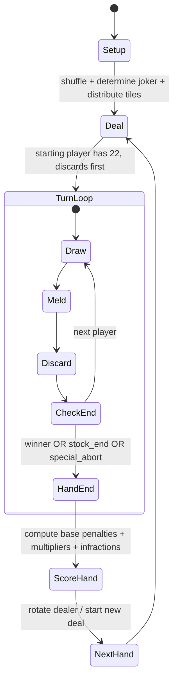

# Turkish Okey 101 Scoring, Penalties, and Edge-Case Ruleset for a Rules Engine

## Executive summary

This report specifies a **deterministic, implementation-ready** ruleset for **Turkish 101 Okey** with a particular focus on **scoring, punishment (ceza) points, and hard edge-cases** that frequently break digital rules engines. The baseline is synthesised from three widely used references: a published tournament rules document from entity["organization","Türkiye Barolar Birliği","national bar association, tr"], the official help centre for entity["company","Zynga","mobile game company"]’s 101 Okey Plus implementation, and the detailed rule compendium at entity["organization","Pagat.com","card game rules website"]. citeturn2view1turn2view2turn7view0turn15view0

The scoring core that most engines need to get right is:

- **Opening requirement:** You may “open” (el açmak) by laying melds worth **≥101 points** (series/sets), or by opening **≥5 pairs** (çift). citeturn2view1turn5search7turn15view0turn21view0  
- **Unopened hand penalty:** If the hand ends and you never opened, you typically take a **fixed 202 penalty** (not the sum of your tiles). citeturn2view2turn6view3turn15view0  
- **Winner credits (“minus points”):** A normal win commonly awards **−101**, and a win by discarding the **joker (okey)** awards **−202**; special wins can scale to **−404** / **−808** in some rule sets. citeturn2view2turn2view3turn7view0turn15view0  
- **Multiplier logic:** Outcomes like **okey-finish**, **double-open (çift)** behaviour, and **eldən bitme** (“800 atma”) scale everyone else’s penalties by 2× / 4× / 8× depending on the configured ruleset. citeturn2view3turn6view4turn7view0turn15view0  
- **Universal 101-point infractions:** Common “instant” punishments are **+101** for (a) attempting to open but not meeting the requirement, and (b) discarding a tile that is **immediately playable (“işlek”)** into an existing meld on the table. citeturn2view1turn2view3turn15view0turn21view0  

The rest of this report turns those concepts into a rules-engine spec: **terminology, formal end conditions, scoring formulas, penalty triggers, and configuration toggles** for rule-variant compatibility.

## Terminology, tiles, and what “okey” means in 101

Okey uses **106 tiles**: four colours, numbers **1–13**, **two copies per colour-number**, plus **two special “false joker” tiles (sahte okey)**. citeturn15view0turn21view0turn22view0turn11view0

A minimal engine-friendly tile model:

- **Numbered tile:** `(colour, value)` where `value ∈ [1..13]`. citeturn15view0turn21view0  
- **False joker (sahte okey):** in many sets these are marked (often with “*”), and at runtime they **take on the identity of the current round’s joker tile** (they represent the joker’s “face”, not a free wildcard). citeturn11view0turn15view0turn21view0  
- **Joker (okey):** determined each hand as “the same colour, one rank higher than the chosen indicator tile” (13 → 1 wrap). citeturn15view0turn21view0turn2view0  

A crucial 101-specific constraint is that **12–13–1 is not a valid run** (1 is low only). This directly affects both **meld validation** and the **101-point opening calculation**. citeturn2view1turn8view1turn15view0turn21view0  

Many widely played 101 variants also treat the “indicator” tile as having **no gameplay function beyond choosing the joker**, i.e., it is not a special scoring tile. citeturn2view1turn9view0turn21view0  

image_group{"layout":"carousel","aspect_ratio":"16:9","query":["Okey tiles set close up","Okey sahte okey tile star","Okey rack isteka tiles","Okey joker indicator tile example"],"num_per_query":1}

## Round setup and turn sequence

### Physical dealing versus digital dealing

Many Turkish descriptions of 101 use a physical method: tiles are arranged into **7-tile bundles (7’li balya)** and dice determine both (a) which bundle is used for distribution and (b) which tile determines the joker. citeturn21view0turn15view0  

For a deterministic digital engine, you can safely replace all of that with a **uniform shuffle of 106 tiles** plus an explicit “choose joker identity” step—as long as your **observable outcomes match**:

- Each player starts with **21 tiles**, and the starting player begins with **22** and discards first (no draw on the opening action). citeturn2view0turn15view0turn21view0  
- Play direction is commonly **anti-clockwise** in widely documented rulesets. citeturn15view0turn21view0  

### Turn structure

A strict turn loop that aligns with published rules:

1. **Draw step:** draw from stock **or** take the immediately previous player’s discard (“soldan/yandan taş”). citeturn15view0turn21view0turn8view2  
2. **Meld step:** optionally open and/or add tiles to melds (subject to opening restrictions). citeturn15view0turn5search9turn21view0  
3. **Discard step (mandatory):** every turn ends with a discard. A player **cannot finish by laying down all tiles without leaving one tile to discard**; in other words, ending with “no tile to discard” is invalid. citeturn2view2turn15view0turn21view0  

A tournament-style phrasing used in some rule documents is: you “finish” by placing your last remaining tile onto the indicator area (or discarding it face-down), and **if you have zero tiles left after melding, the game does not end** because there was no finishing discard. citeturn2view2turn2view4turn15view0  

### Taking the discard has a legality constraint

A widely documented constraint is that you may only take the previous discard if it is **immediately used** (either to open or to make a legal lay-off); you cannot take it into hand “for later”. citeturn15view0turn8view2turn2view1  

In some tournament rules, taking the discard **forces an opening attempt** if you have not opened yet, and returning the tile is explicitly penalised. citeturn2view1turn19view0  

Engine recommendation: implement this as **server-side validation**: “discard_take must be consumed in the same atomic move” or the move is rejected (optionally with an automatic penalty if your product design prefers punitive enforcement). citeturn15view0turn2view1  

## Meld types, opening requirements, and legal moves

### Meld types you must support

A comprehensive 101 engine needs exactly three meld families:

- **Set (üçlü/dörtlü):** 3 or 4 tiles of the **same number**, **all different colours**. Duplicate colours in the same set are invalid. citeturn15view0turn21view0  
- **Run / sequence (seri):** 3+ consecutive numbers of the **same colour**, with **1 low only** (no 12–13–1). citeturn2view1turn8view1turn15view0turn21view0  
- **Pairs (çift):** two **identical tiles** (same colour, same number). Pairs are not extendable as pairs. citeturn15view0turn21view0  

### Opening requirement: “101” or “five pairs”

A player who opens via sets/runs must place, in **one turn**, melds from hand with a total value **≥101**. For this purpose, tiles count at face value, and jokers count as the value they represent within the specific meld. citeturn15view0turn2view1turn21view0  

A second opening mode is “opening with pairs” (çiftten açmak): commonly **at least 5 pairs in one turn**. citeturn2view1turn5search7turn15view0turn21view0  

A key restriction that must be enforced:

- If you open with **sets/runs**, you may not later create new **pairs** as your own melds that hand.  
- If you open with **pairs**, you may not later create new **sets/runs** as your own melds that hand. citeturn15view0turn10view1turn2view1turn21view0  

### Lay-offs (işleme) and when they are allowed

Most documented rulesets require that you must **open before you may lay off** onto existing melds. citeturn15view0turn5search9turn21view0  

Compatibility rule worth including because it appears in widely played digital rules:

- A player who opened with pairs is still allowed to lay off onto another player’s run. citeturn10view2turn15view0turn21view0  
- A player who opened with sets/runs may lay off onto a “pairs area” only if someone has opened with pairs (i.e., pairs are only “processable” when a pairs-opener exists). citeturn2view2turn10view3turn21view0  

### Joker behaviour: two common modes you should make configurable

There is a significant rule split on whether a joker placed into a meld can be reclaimed:

- **Non-reclaimable joker mode:** once a joker is placed, it stays; no swapping it out. citeturn15view0  
- **Reclaimable joker mode (common in Turkish tables and digital 101):** if a joker is on the table representing a real tile, a player who holds the corresponding real tile may swap it and take the joker—typically only after that player has opened. citeturn2view2turn8view3turn21view0turn19view0  

Because both appear in reputable descriptions, a “most comprehensive” rules engine should implement this as a **rules toggle**.

## Ending a hand and special finishes

### Normal finish

A hand ends when a player has melded all tiles **except one** and then discards the last tile as the finishing discard. citeturn15view0turn2view2turn21view0  

Finishing by discarding an **ordinary (non-joker) tile** is treated as a baseline “normal finish” in most scoring systems. citeturn15view0turn21view0turn2view3  

### Okey finish

If the finishing discard is the **joker (okey)**, many mainstream rulesets treat it as a stronger finish that **doubles penalties** for others and gives the winner a larger negative score. citeturn7view0turn15view0turn2view3  

### Elden bitme (“800 atma”)

A common special condition is **eldən bitme**: when **nobody has opened yet**, a player opens and finishes **in a single turn** by laying everything (without lay-offs) and discarding to end, causing other players to take a **doubled fixed penalty** (often shown as 404 for each opponent in 4-player free-for-all scoring). citeturn6view4turn15view0turn2view2  

Some tournament rules further allow a “one-turn open-and-finish” even if the opener’s meld value does not reach 101 (the “single-turn complete-hand override”), which is highly impactful and should be a configurable rules feature if you aim for tournament parity. citeturn2view2turn19view0  

### “Devam” / double-joker continuation

Some Turkish rule descriptions define an extended win in which a player discards one joker (announcing continuation) and plays on to discard the **second joker**, multiplying the hand value further (often 4× versus normal). citeturn22view0turn2view3  

Other 101 rule lists explicitly reject “double okey” as a concept, so you should treat “devam” as **optional** rather than assumed. citeturn19view0turn2view4  

### Stock exhaustion

Documented rules diverge on what happens if the stock runs out:

- Some descriptions end the hand with **no scoring** (except potential joker-in-hand penalties), and the same dealer re-deals. citeturn15view0  
- Others end the hand and score everyone by remaining tiles (with unopened fixed 202). citeturn2view2turn21view0  

Because this materially changes match outcomes, it should be a server-side rules toggle.

## Scoring and punishment points

This section is designed to be directly implemented as code.

### Base scoring model

Most 101 scoring systems can be expressed as:

1. Compute each player’s **base penalty points** for the hand:
   - If the player **never opened**, base penalty is **202** (fixed). citeturn6view3turn2view2turn15view0  
   - If the player **opened**, base penalty is usually the **sum of values of tiles remaining in their rack** (tiles not melded/laid off). citeturn2view2turn15view0turn21view0  

2. Apply an **opening-type multiplier** (commonly 2×) if the player opened with **pairs**. citeturn6view2turn2view3turn15view0  

3. Apply an **outcome multiplier** depending on how the hand ended (normal = 1×, okey-finish = 2×, “devam” often = 4×, “eldən devam” often = 8× in some tournament tables). citeturn2view3turn7view0turn22view0  

4. Apply the **winner credit** (negative points) to the winner (or winning team), commonly −101 for normal and −202 for okey-finish, with escalations for paired finishes and special cases. citeturn15view0turn7view0turn2view3  

### Scoring outcome table

The table below maps common end conditions to a practical scoring function. Where rulesets disagree, the row is marked “variant”.

| End condition | Winner credit (typical) | Outcome multiplier on others | Unopened player penalty | Key sources |
|---|---:|---:|---:|---|
| Normal finish (non-joker discard) | −101 | ×1 | 202 | citeturn15view0turn21view0turn2view3 |
| Okey finish (joker as finishing discard) | −202 | ×2 | 404 | citeturn7view0turn15view0turn2view3 |
| Winner opened with pairs, finishes normally | −202 | ×2 | 404 | citeturn15view0turn2view3 |
| Winner opened with pairs and finishes with okey | −404 | ×4 | **404 or 808 (variant)** | citeturn15view0turn2view3turn22view0 |
| Elden bitme (“800 atma”), last discard non-joker | −202 | ×2 | 404 | citeturn6view4turn15view0turn2view2 |
| Elden bitme + okey finish | −404 | ×4 | 808 | citeturn15view0turn2view3 |
| Devam / double-joker continuation (optional) | −404 | ×4 | 808 | citeturn22view0turn2view3 |
| Elden devam (optional extreme) | −808 | ×8 | 1616 | citeturn2view3turn22view0 |

Implementation note: a consistent engine approach is to define:
- `unopened_base = 202`  
- `pairs_open_multiplier = 2`  
- `outcome_multiplier ∈ {1,2,4,8}`  
- `winner_credit = -101 * winner_factor`  
and expose rule-variant caps (notably the “pairs+okey unopened cap”) as configuration.

### Joker-in-hand penalties

Many Turkish 101 descriptions include an extra penalty when a player has an **okey tile left in their rack** at hand end (commonly +101). citeturn6view1turn2view2turn15view0  

However, there is ambiguity about whether this stacks on top of the **fixed 202 unopened penalty**. A conservative, compatibility-first engine design is:

- If **unopened**: score fixed unopened penalty (202, or multiplied), and **do not add** extra joker-in-hand penalties (toggleable). citeturn6view3turn15view0  
- If **opened**: treat each unplayed joker as **101 penalty points** (equivalent to “joker tile value = 101” for end scoring). citeturn15view0turn6view1  

### “101-point punishments” (ceza) you should implement

The following are recurring +101 penalties that are both common and implementation-relevant:

| Infraction | Engine-detectable trigger | Typical penalty | Sources |
|---|---|---:|---|
| Invalid open (attempted opening doesn’t meet 101 or lacks enough pairs) | Player tries to commit an opening meld-set that fails validation | +101 | citeturn2view1turn15view0turn21view0 |
| Discarding a playable/attachable tile (“işlek taş”) | Discard tile can extend any current legal table meld | +101 | citeturn2view3turn15view0turn21view0 |
| Discarding the joker (not as a winning discard) | Player discards joker and does not end the hand | +101 | citeturn15view0turn2view3turn21view0 |
| Taking back multiple laid tiles (“take-back abuse”) | Player reverses >1 committed table placements in the same action window | +101 | citeturn15view0turn21view0 |
| Taking the discard when you cannot legally use it immediately | Take-discard move without same-turn consumption | (reject or +101) | citeturn2view1turn15view0turn8view2 |

Some physical/tournament rules require an opponent to “call” the işlek tile before the next draw for the penalty to apply (a social verification mechanic). Digital engines usually replace that with **automatic detection** because it is deterministic and prevents disputes. citeturn2view3turn15view0turn21view0  

### Team (eşli) scoring rules

If you support “eşli” (partners), implement team scoring as the sum of both partners’ hand scores, but note a common tournament rule: **if one partner finishes, the other partner’s penalty is removed** (effectively forced to 0 for that hand), even if the partner never opened. citeturn2view3turn19view0  

This feature dramatically changes incentives and should be a clearly labelled rules toggle for your game modes.

## Implementation-ready specification

### State machine (hand lifecycle)



This flow matches the “draw → meld → discard (mandatory)” loop and the documented requirement that a player must always end their action with a discard. citeturn15view0turn2view2turn21view0  

### Rules configuration schema (recommended)

Use a single authoritative server-side rules object so you can support tournaments, “Zynga-like” lobbies, and house rules:

```json
{
  "ruleset_name": "turkish_101_default",
  "players": 4,
  "allow_teams": true,

  "opening": {
    "min_points_sets_runs": 101,
    "min_pairs_to_open": 5,
    "one_turn_finish_ignores_101": false
  },

  "melds": {
    "allow_12_13_1_run": false,
    "allow_joker_reclaim": true,
    "max_layoffs_per_turn_for_pairs_opener": null
  },

  "end_conditions": {
    "stock_exhaustion_ends_hand": true,
    "all_players_open_pairs_aborts_hand": true,
    "require_final_discard_to_finish": true
  },

  "scoring": {
    "unopened_penalty": 202,
    "pairs_open_multiplier": 2,
    "joker_tile_unplayed_value": 101,
    "unopened_gets_extra_joker_penalty": false,

    "outcome_multipliers": {
      "normal": 1,
      "okey_finish": 2,
      "devam_finish": 4,
      "eldan_finish": 2,
      "eldan_okey_finish": 4,
      "eldan_devam_finish": 8
    },

    "winner_credits": {
      "normal": -101,
      "okey_finish": -202,
      "pairs_finish": -202,
      "pairs_okey_finish": -404,
      "eldan_finish": -202,
      "eldan_okey_finish": -404,
      "devam_finish": -404,
      "eldan_devam_finish": -808
    },

    "cap_unopened_penalty_when_pairs_and_okey": null
  },

  "infractions": {
    "invalid_open_penalty": 101,
    "discard_playable_tile_penalty": 101,
    "discard_joker_penalty": 101,
    "takeback_multiple_tiles_penalty": 101
  }
}
```

Each field above maps directly to at least one documented rule divergence (especially joker reclaim, stock exhaustion scoring, and “devam”). citeturn15view0turn2view3turn8view3turn21view0turn22view0  

### Ready-to-use GDScript scoring skeleton

This snippet is intentionally “server-authoritative”: it treats the table state as truth and computes a final per-player score vector for one hand.

```gdscript
# Scoring helpers for Turkish 101 Okey.
# Assumes you already validated meld legality during play.
class_name Okey101Scoring

enum OpenType { NONE, SETS_RUNS, PAIRS }
enum FinishType {
    NORMAL,          # last discard is not joker
    OKEY_FINISH,     # last discard is joker
    PAIRS_FINISH,    # winner opened with pairs, last discard not joker
    PAIRS_OKEY,      # winner opened with pairs, last discard is joker
    ELDAN,           # nobody opened before winner; winner finished in one turn
    ELDAN_OKEY,
    DEVAM,           # optional: double-joker continuation
    ELDAN_DEVAM
}

static func compute_hand_scores(
    players: Array, # Array of dictionaries with fields below
    finish_type: int,
    rules: Dictionary
) -> Dictionary:
    # players[i] fields expected:
    # - opened: bool
    # - open_type: OpenType
    # - rack_tiles: Array[Dictionary] with {value:int, is_unplayed_joker:bool}
    # - infractions_101: int (count of +101 infractions already assessed)
    # - is_winner: bool
    # - team_id: int (optional; -1 if FFA)

    var scores := {}
    for p in players:
        var pid = p.get("id", players.find(p))
        scores[pid] = 0

    # Resolve winner credit and outcome multiplier
    var winner_credit = rules["scoring"]["winner_credits"].get(_finish_key(finish_type), 0)
    var outcome_mult = rules["scoring"]["outcome_multipliers"].get(_finish_key(finish_type), 1)

    # First pass: base penalties
    for p in players:
        var pid = p.get("id", players.find(p))
        var base_penalty: int = 0

        if p.open_type == OpenType.NONE:
            base_penalty = rules["scoring"]["unopened_penalty"]
        else:
            base_penalty = 0
            for t in p.rack_tiles:
                if t.get("is_unplayed_joker", false):
                    base_penalty += rules["scoring"]["joker_tile_unplayed_value"]
                else:
                    base_penalty += int(t["value"])

        # Pairs opener multiplier
        if p.open_type == OpenType.PAIRS:
            base_penalty *= rules["scoring"]["pairs_open_multiplier"]

        # Apply outcome multiplier to non-winners
        var penalty = base_penalty
        if not p.is_winner:
            penalty *= outcome_mult

        # Add infractions (+101 blocks)
        penalty += int(p.get("infractions_101", 0)) * rules["infractions"]["invalid_open_penalty"]
        scores[pid] += penalty

    # Winner credit (negative score) applied to the winner only
    for p in players:
        if p.is_winner:
            var pid = p.get("id", players.find(p))
            scores[pid] += winner_credit
            break

    # Optional: team rule "partner's penalty is removed if teammate wins"
    if rules.get("allow_teams", false):
        var winner_team = -1
        for p in players:
            if p.is_winner:
                winner_team = p.get("team_id", -1)
                break
        if winner_team != -1:
            for p in players:
                if p.get("team_id", -1) == winner_team and not p.is_winner:
                    var pid = p.get("id", players.find(p))
                    scores[pid] = 0

    return scores


static func _finish_key(finish_type: int) -> String:
    match finish_type:
        FinishType.NORMAL: return "normal"
        FinishType.OKEY_FINISH: return "okey_finish"
        FinishType.PAIRS_FINISH: return "pairs_finish"
        FinishType.PAIRS_OKEY: return "pairs_okey_finish"
        FinishType.ELDAN: return "eldan_finish"
        FinishType.ELDAN_OKEY: return "eldan_okey_finish"
        FinishType.DEVAM: return "devam_finish"
        FinishType.ELDAN_DEVAM: return "eldan_devam_finish"
        _: return "normal"
```

This skeleton reflects the widely used “202 unopened” rule, pair multipliers, okey-finish doubling, and special hand-end multipliers, while keeping the most controversial parts (joker reclaim, stock exhaustion scoring, “devam”) outside scoring and instead within your **move validation and finish detection**. citeturn2view3turn6view3turn7view0turn15view0turn22view0  

### Minimal finish-detection checklist

To avoid subtle scoring bugs, treat finish detection as a separate deterministic function that emits a `(finish_type, winner_id)` pair based on:

- Did the winner open with **pairs** or **sets/runs**? citeturn15view0turn10view1  
- Is the finishing discard a **joker**? citeturn7view0turn15view0  
- Had **anyone** opened before the winner’s open-and-finish turn (eldan)? citeturn6view4turn2view2  
- Did the hand end by **stock exhaustion** (and how does your ruleset score it)? citeturn15view0turn2view2turn21view0  
- Is “devam” enabled, and did the winner trigger the **double-joker continuation** sequence? citeturn22view0turn2view3  

If you implement those checks and the penalty table above, you should be able to reproduce the overwhelming majority of real-table 101 scoring outcomes without disputes.